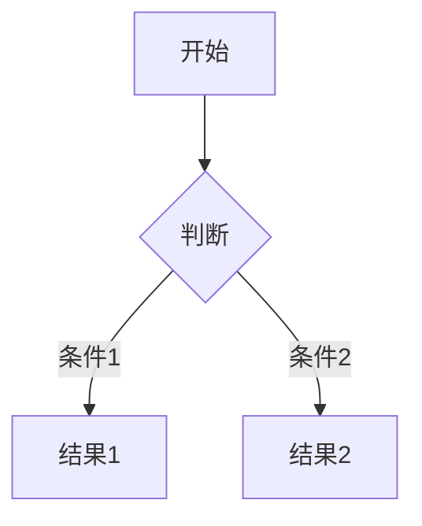
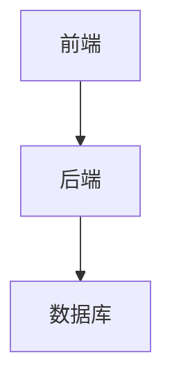
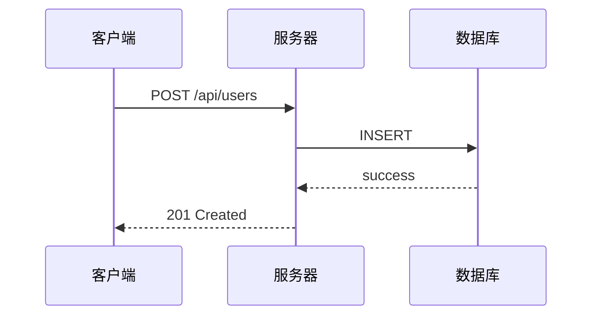

# Markdown 文档技能

## 概述

本技能支持创建高质量的 Markdown 文档，主要功能包括：

- **Mermaid 图表** - 流程图、时序图、类图、状态图、ER 图、甘特图、饼图等
- **KaTeX 公式** - LaTeX 风格的行内（`$...$`）和块级（`$$...$$`）数学表达式
- **Kroki 图片渲染** - 通过 Docker Compose 启动 Kroki 服务，将图表定义转换为 PNG/SVG 图片

## 核心原则

1. **图表优先使用 Mermaid** - 所有流程图、时序图、类图、状态图、甘特图、饼图等优先使用 Mermaid 语法
2. **公式使用 KaTeX** - 数学公式采用 KaTeX 语法，兼容 LaTeX 书写习惯
3. **Kroki 用于图片导出** - 当需要独立的 PNG 图片时，使用 Kroki Docker 服务进行渲染
4. **文档自包含** - HTML 输出优先使用内联 Mermaid/KaTeX；需要 PNG 时使用 Kroki

## 工作流程

### 1. 文档结构规划

创建结构良好的 Markdown 文档：

1. 明确文档目的和受众
2. 规划章节及内容
3. 确定需要图表或公式的章节
4. 选择渲染方式：
   - **HTML 输出** → 内联 Mermaid + KaTeX（推荐）
   - **PNG 图片** → Kroki 渲染
   - **PDF 输出** → 考虑使用 Pandoc + 内联渲染

### 2. Mermaid 图表使用

#### 基础语法



#### 常用图表类型

| 类型 | 语法关键词 | 适用场景 |
|------|-----------|---------|
| 流程图 | `graph`, `flowchart` | 业务流程、决策流程 |
| 时序图 | `sequenceDiagram` | API 调用、交互序列 |
| 类图 | `classDiagram` | 面向对象设计 |
| 状态图 | `stateDiagram` | 状态机、生命周期 |
| ER 图 | `erDiagram` | 数据库设计 |
| 甘特图 | `gantt` | 项目计划、时间线 |
| 饼图 | `pie` | 数据比例展示 |

#### HTML 中内联渲染

```html
<!DOCTYPE html>
<html>
<head>
    <script src="https://cdn.jsdelivr.net/npm/mermaid@10/dist/mermaid.min.js"></script>
    <link rel="stylesheet" href="https://cdn.jsdelivr.net/npm/katex@latest/dist/katex.min.css">
    <script src="https://cdn.jsdelivr.net/npm/katex@latest/dist/katex.min.js"></script>
</head>
<body>
<div class="mermaid">
graph TD
    A[开始] --> B[处理]
    B --> C[结束]
</div>
<script>
    mermaid.initialize({ startOnLoad: true });
</script>
</body>
</html>
```

### 3. KaTeX 公式使用

#### 行内公式

使用 `$...$` 包裹：

```markdown
欧拉公式：$e^{i\pi} + 1 = 0$
```

#### 块级公式

使用 `$$...$$` 包裹，居中显示：

```markdown
$$
\int_{-\infty}^{\infty} e^{-x^2} dx = \sqrt{\pi}
$$
```

#### 常用公式示例

| 类型 | 示例 |
|------|------|
| 分数 | `\frac{a}{b}` |
| 上标 | `x^2` |
| 下标 | `x_i` |
| 开方 | `\sqrt{x}` |
| 求和 | `\sum_{i=1}^{n}` |
| 积分 | `\int_{a}^{b}` |
| 矩阵 | `\begin{pmatrix} a & b \\ c & d \end{pmatrix}` |

#### HTML 中内联渲染

```html
<!DOCTYPE html>
<html>
<head>
    <link rel="stylesheet" href="https://cdn.jsdelivr.net/npm/katex@latest/dist/katex.min.css">
    <script src="https://cdn.jsdelivr.net/npm/katex@latest/dist/katex.min.js"></script>
</head>
<body>
    <p>欧拉公式：<span id="formula"></span></p>
    <script>
        katex.render("e^{i\\pi} + 1 = 0", document.getElementById("formula"));
    </script>
</body>
</html>
```

### 4. Kroki 图片渲染

当需要生成独立的 PNG/SVG 图片文件时，使用 Kroki 服务。

#### Docker Compose 配置

在项目根目录创建 `docker-compose.kroki.yml`：

```yaml
version: '3.8'
services:
  kroki:
    image: yuzutech/kroki
    container_name: kroki
    ports:
      - "8080:8080"
    environment:
      - KROKI_MERMAID_WIDTH=800
      - KROKI_MERMAID_HEIGHT=600
    restart: unless-stopped
```

启动服务：

```bash
docker compose -f docker-compose.kroki.yml up -d
```

#### Kroki URL 格式

```
https://kroki.io/{diagram_type}/{output_format}/{url_encoded_definition}

# 示例：Mermaid 流程图渲染为 PNG
https://kroki.io/mermaid/png/%%7Bgraph%20TD%7D%20A%5B%E5%BC%80%E5%A7%8B%5D%20--%3E%20B%5B%E7%BB%93%E6%9D%9F%5D%7D
```

#### 使用 scripts/kroki_render.py 脚本

本技能提供了 `scripts/kroki_render.py` 脚本，用于简化 Kroki 图片生成：

```bash
# 渲染 Mermaid 图表为 PNG
python scripts/kroki_render.py --type mermaid --output output.png --content "graph TD; A[开始] --> B[结束]"

# 渲染多个图表
python scripts/kroki_render.py --type mermaid --output ./diagrams/ --input diagrams.yml
```

详细使用方法见 `scripts/README.md`。

## 常用文档模板

### 技术文档

```markdown
# 项目名称

## 概述
[项目简介]

## 架构设计
[架构图]



## 核心模块

### 模块 1
[详细说明]

## API 文档

### 接口 1
**请求：**
$$POST /api/v1/resource$$

**参数：**
| 参数名 | 类型 | 必填 | 说明 |
|--------|------|------|------|

**响应：**
```json
{}
```

## 数学背景
[相关公式]
$$\int_0^1 x^2 dx = \frac{1}{3}$$
```

### API 文档

```markdown
# API 文档

## 用户管理

### 创建用户

**请求：**
$$POST /api/users$$

**请求体：**
```json
{
  "name": "string",
  "email": "string"
}
```

**响应：**
$$200 \ OK$$


```

## 资源

### scripts/

- `kroki_render.py` - Kroki 图片渲染脚本，支持 Mermaid 等多种图表类型

### references/

- `mermaid_cheatsheet.md` - Mermaid 语法速查表
- `katex_cheatsheet.md` - KaTeX 公式语法速查表
- `kroki_guide.md` - Kroki 服务使用指南
