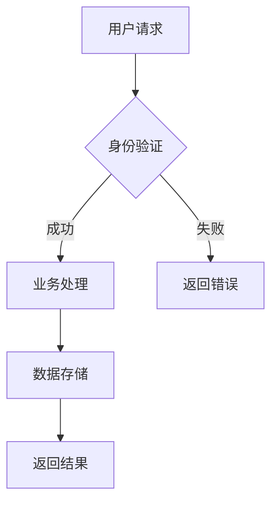
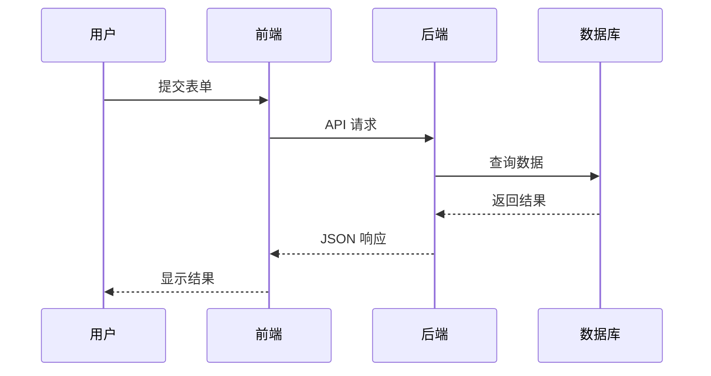
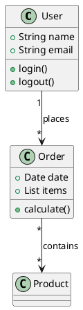
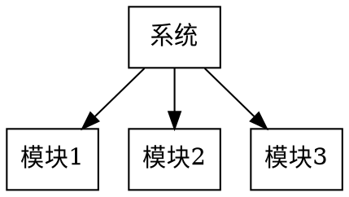

# Kroki 使用指南

## 概述

[Kroki](https://kroki.io) 是一个将图表定义转换为图片的服务，支持多种图表语言。

## Docker Compose 快速启动

### 1. 创建配置文件

在项目根目录创建 `docker-compose.kroki.yml`：

```yaml
version: '3.8'
services:
  kroki:
    image: yuzutech/kroki
    container_name: kroki
    ports:
      - "8080:8080"
    environment:
      # Mermaid 图表默认尺寸
      - KROKI_MERMAID_WIDTH=800
      - KROKI_MERMAID_HEIGHT=600
      # 支持的图表类型
      - KROKI_DIAGRAMS=blockdiag,bpmn,bytefield,Seqdiag,Actdiag,Packetdiag,Rackdiag,Commonmarker,Ditaa,Graphviz,Mermaid,Nomnoml,PlantUML,Svgbob,Umlet,Vega,VegaLite,WaveDrom,Wavedrom
    restart: unless-stopped
    healthcheck:
      test: ["CMD", "curl", "-f", "http://localhost:8080"]
      interval: 30s
      timeout: 10s
      retries: 3
```

### 2. 启动服务

```bash
docker compose -f docker-compose.kroki.yml up -d
```

### 3. 验证服务

```bash
curl http://localhost:8080
# 返回: Kroki - Version: x.x.x
```

---

## 支持的图表类型

| 类型 | 语言 | 说明 |
|------|------|------|
| mermaid | Mermaid | 流程图、时序图、类图等 |
| plantuml | PlantUML | UML 图 |
| graphviz | Graphviz DOT | 有向图 |
| wavedrom | WaveDrom | 数字时序图 |
| ditaa | Ditaa | ASCII 艺术图 |
| svgbob | Svgbob | ASCII 艺术转 SVG |
| blockdiag | BlockDiag | 块图 |
| seqdiag | SeqDiag | 时序图 |
| actdiag | ActDiag | 活动图 |
| packetdiag | PacketDiag | 数据包图 |
| rackdiag | RackDiag | 机架图 |
| vega | Vega | 可视化语法 |
| vegalite | Vega-Lite | 声明式可视化 |
| nomnoml | Nomnoml | UML 类图 |
| umlet | Umlet | UML 图 |
| commonmarker | CommonMarker | Markdown 渲染 |

---

## API 使用方式

### URL 格式

```
http://localhost:8080/{diagram_type}/{output_format}/{encoded_definition}
```

**参数说明：**
- `diagram_type`: 图表类型 (mermaid, plantuml 等)
- `output_format`: 输出格式 (png, svg, pdf)
- `encoded_definition`: URL 编码的图表定义

### 示例

#### Mermaid 流程图

```bash
# 图表定义
content="graph TD; A[开始] --> B[处理]; B --> C[结束]"

# URL 编码
encoded=$(echo -n "$content" | base64 | tr -d '=' | tr '+/' '-_')

# 访问
curl -o flowchart.png "http://localhost:8080/mermaid/png/$encoded"
```

#### 直接 URL 构造

对于简单的图表，可以直接使用 Kroki 官网：

```
https://kroki.io/mermaid/png/eyJncmFwaCI6ICJBW0lubmVdIC0tPiBCW091dF0ifQ
```

解码后为：`{"graph": "A[In] --> B[Out]"}`

---

## 常用示例

### 1. Mermaid 流程图



### 2. Mermaid 时序图



### 3. PlantUML 类图



### 4. Graphviz DOT 图



---

## 与脚本配合使用

使用本技能提供的 `kroki_render.py` 脚本可以简化操作：

```bash
# 单个图表
python scripts/kroki_render.py \
  --type mermaid \
  --content "graph TD; A --> B" \
  --output flowchart.png

# 批量渲染
python scripts/kroki_render.py \
  --config diagrams.yml \
  --output ./output/
```

详见 `scripts/README.md`。

---

## 常见问题

### Q: 服务启动失败

检查端口是否被占用：
```bash
lsof -i :8080
```

### Q: 图表渲染超时

增大超时时间或检查网络：
```yaml
services:
  kroki:
    environment:
      - KROKI_TIMEOUT=120
```

### Q: 中文乱码

Kroki Docker 镜像默认不支持中文，需要自定义字体：
```yaml
services:
  kroki:
    volumes:
      - ./fonts:/usr/share/fonts
    environment:
      - KROKI_FONTS=/usr/share/fonts
```

### Q: 图片尺寸不合适

调整 Mermaid 尺寸参数：
```yaml
environment:
  - KROKI_MERMAID_WIDTH=1200
  - KROKI_MERMAID_HEIGHT=800
```
