# Mermaid 语法速查表

## 流程图 (Flowchart)

### 方向

| 方向 | 说明 |
|------|------|
| `TD` / `TB` | 从上到下 (Top-Down / Top-Bottom) |
| `BT` | 从下到上 (Bottom-Top) |
| `LR` | 从左到右 (Left-Right) |
| `RL` | 从右到左 (Right-Left) |

### 节点形状

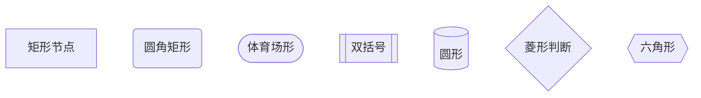

### 连线样式

```mermaid
graph TD
    A --> B          %% 箭头实线
    A --- B          %% 无箭头实线
    A -.-> B         %% 虚线箭头
    A -. B           %% 虚线无箭头
    A ==> B          %% 加粗箭头
    A == B           %% 加粗无箭头
    A -- 标签 --> B  %% 带标签箭头
    A --->|标签| B   %% 带标签箭头 (替代语法)
```

### 子图

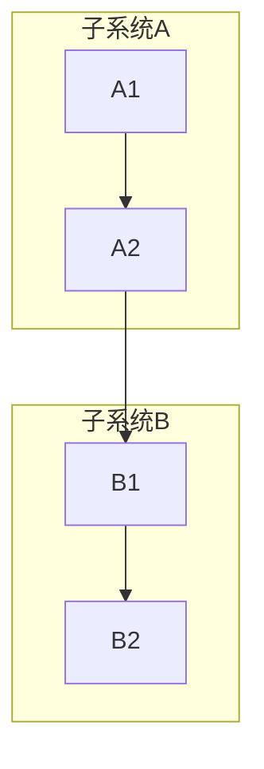

---

## 时序图 (Sequence Diagram)

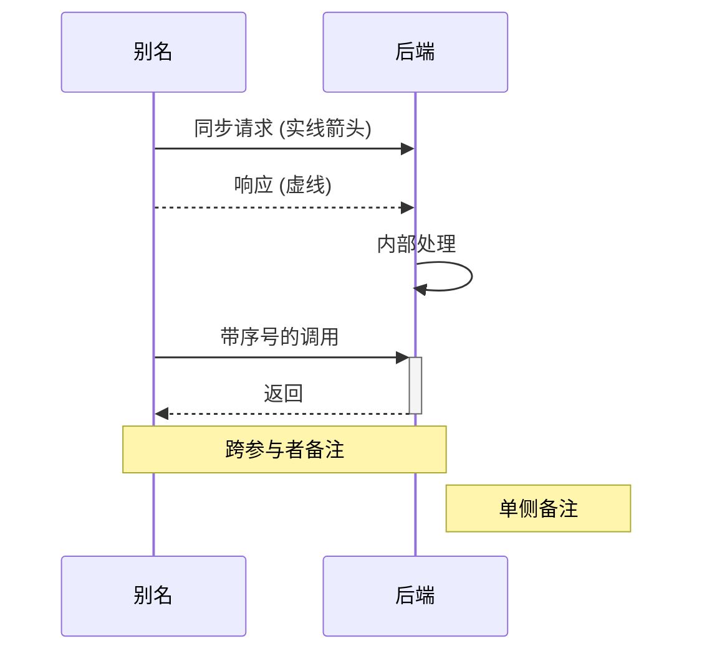

### 时序图控制

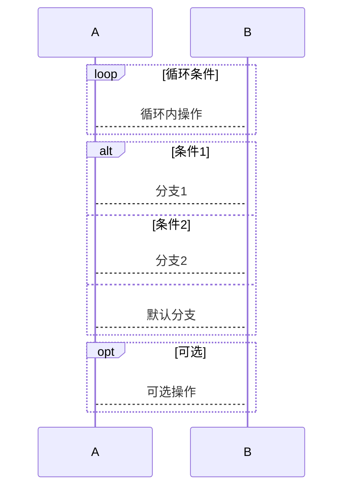

---

## 类图 (Class Diagram)

```mermaid
classDiagram
    class Animal {
        +String name
        +int age
        +makeSound()
        +feed()
    }

    class Dog {
        +String breed
        +bark()
    }

    class Cat {
        +boolean indoor
        +meow()
    }

    Animal <|-- Dog : 继承
    Animal <|-- Cat : 继承
    Animal <|>| 企鹅 : 多态
```

### 关系符号

| 符号 | 关系 |
|------|------|
| `<|--` | 继承 |
| `*--` | 组合 (Composition) |
| `o--` | 聚合 (Aggregation) |
| `-->` | 关联 (Association) |
| `-->` | 依赖 (Dependency) |
| `..>` | 实现 (Realization) |
| `..` | 虚线 (Linetype) |

---

## 状态图 (State Diagram)

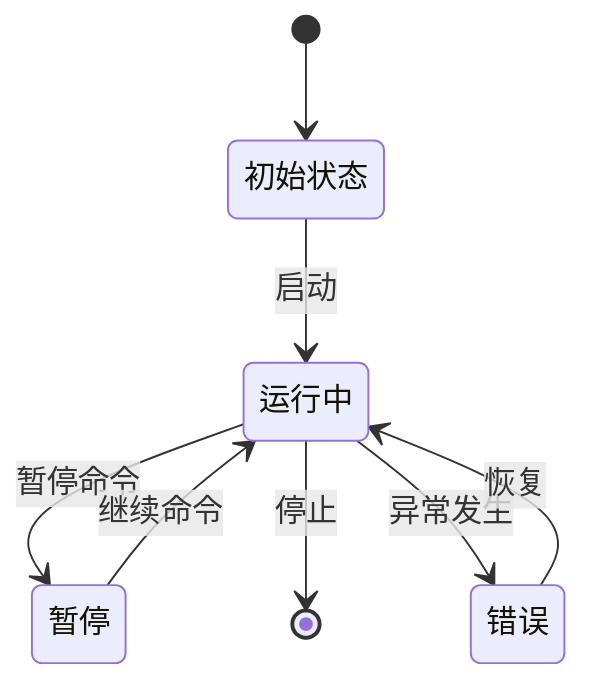

### 分支状态

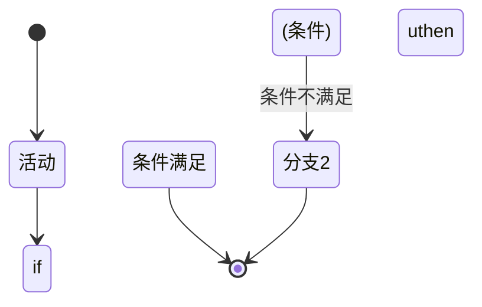

---

## ER 图 (ER Diagram)

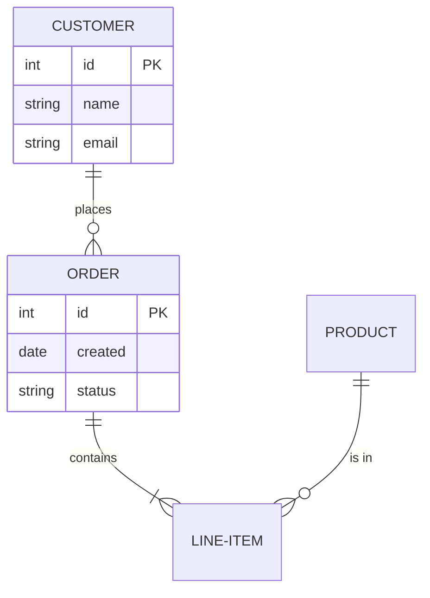

---

## 甘特图 (Gantt)

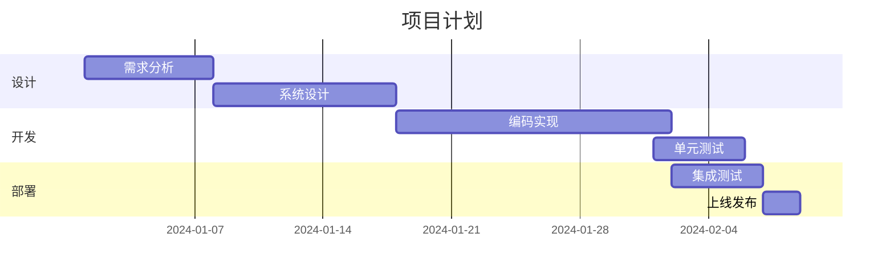

---

## 饼图 (Pie)

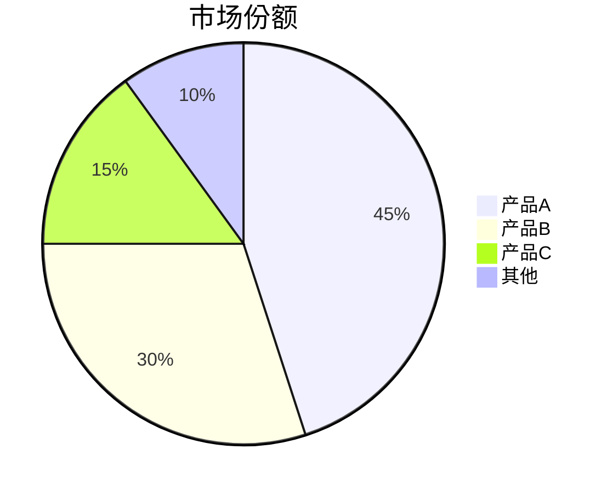

---

## Git 图表

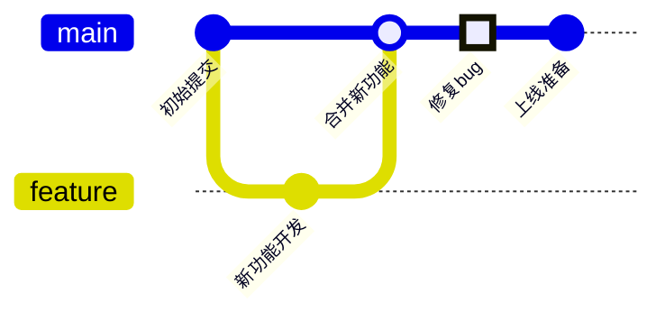

---

## 提示技巧

1. **ID 和标签**: 节点 ID 必须是单字母或单词；标签可以是中文
2. **转义字符**: 特殊字符用双引号包裹或转义
3. **注释**: 使用 `%%` 添加注释
4. **多行文本**: 使用 `br` 换行

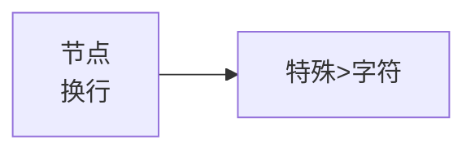
