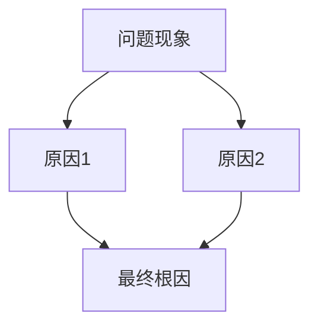

# Qt 问题定位与调试工作流

## 概述

本技能提供交互式问题诊断与解决工作流，核心流程：

```
收集问题信息 → 问题分类与诊断 → 调用技术知识 → 解决方案验证 → 生成报告
```

### 与 qt-debugging 的关系

| 角色 | 技能 | 职责 |
|------|------|------|
| **工作流入口** | qt-troubleshooting（本技能） | 交互式收集问题、引导诊断流程、生成报告 |
| **技术知识库** | qt-debugging | 提供具体调试技术、代码示例、工具配置 |

本技能**调用** qt-debugging 获取技术细节，不重复其内容。

---

## 强制工作流

### 第 1 步：收集问题信息（交互式）

通过结构化问询收集必要信息：

#### 1.1 基本信息确认

```
┌─────────────────────────────────────────────────────────────┐
│  🔍 问题信息收集                                            │
├─────────────────────────────────────────────────────────────┤
│                                                             │
│  请提供以下信息（尽量详细）：                                │
│                                                             │
│  1️⃣  问题现象描述                                            │
│     - 问题表现为什么？（崩溃、卡顿、显示异常、功能失效...）   │
│     - 首次出现时间？频率？（必现/偶发/特定条件下）           │
│                                                             │
│  2️⃣  环境信息                                                │
│     - 操作系统 + Qt 版本                                     │
│     - 编译器版本（g++/clang++/MSVC）                         │
│     - 构建类型（Debug/Release）                              │
│                                                             │
│  3️⃣  复现步骤                                                │
│     - 明确的操作步骤（1、2、3...）                           │
│     - 期望行为 vs 实际行为                                   │
│                                                             │
│  4️⃣  相关代码/日志                                            │
│     - 粘贴关键代码段（崩溃附近）                             │
│     - 错误日志/终端输出                                       │
│     - 崩溃堆栈（如有）                                       │
│                                                             │
│  5️⃣  已尝试的解决方法                                         │
│     - 尝试过的方案                                           │
│     - 结果（有效/无效）                                      │
│                                                             │
└─────────────────────────────────────────────────────────────┘
```

#### 1.2 快速分类识别

根据用户描述，快速识别问题类别：

| 类别 | 关键词 | 可能原因 |
|------|--------|----------|
| **崩溃类** | segfault、段错误、assertion failed | 内存访问违规、对象生命周期、线程问题 |
| **UI类** | widget不显示、白屏、样式异常 | 父对象问题、事件循环、QSS解析 |
| **性能类** | 卡顿、响应慢、内存占用高 | 阻塞调用、内存泄漏、渲染效率 |
| **通信类** | 信号不触发、槽未调用、连接失败 | Q_OBJECT问题、签名不匹配、线程边界 |
| **运行时类** | QPainter error、QPixmap error | 图形上下文、线程亲和性、资源初始化 |

---

### 第 2 步：问题诊断与分析

#### 2.1 问题定位决策树

```
问题现象
    │
    ├── 崩溃/段错误
    │       ├── 是否有堆栈信息？ → 分析堆栈 + 调用 qt-debugging "崩溃诊断"
    │       ├── 是否有 ASAN/UBSAN 输出？ → 分析内存错误
    │       └── 是否在 Qt 事件处理中？ → 检查对象生命周期
    │
    ├── UI 异常
    │       ├── widget 不显示？ → 调用 qt-debugging "Widget 显示问题"
    │       ├── 样式异常？ → 检查 QSS + 调用 qt-debugging "QSS 调试"
    │       └── 绘制错误？ → 检查 QPainter 使用 + 图形上下文
    │
    ├── 功能异常
    │       ├── 信号未触发？ → 检查 Q_OBJECT + 连接方式 + 调用 qt-debugging "信号槽"
    │       ├── 数据不一致？ → 检查模型/视图架构
    │       └── 配置丢失？ → 检查 QSettings + 文件权限
    │
    ├── 性能问题
    │       ├── 调用 performance-profiling 技能
    │       └── 检查内存泄漏 + 调用 qt-debugging "内存检测"
    │
    └── 运行时错误
            ├── Qt 警告信息 → 分析警告 + 调用 qt-debugging "Qt 消息处理"
            └── 第三方库错误 → 检查集成方式
```

#### 2.2 诊断信息请求

根据分类，请求补充信息：

```markdown
## 诊断补充信息

为更精确定位问题，请提供：

### 崩溃问题
- [ ] 完整的崩溃堆栈（`bt` 命令输出）
- [ ] ASAN 日志（如有）
- [ ] 崩溃前的最后操作

### UI 问题
- [ ] 相关 widget 的父对象关系
- [ ] `isVisible()` / `size()` / `geometry()` 诊断输出
- [ ] 是否在 `show()` 后立即访问？

### 信号槽问题
- [ ] 信号和槽的签名（参数类型）
- [ ] 连接方式（Direct/Queued/Blocking）
- [ ] 是否使用了 `Q_OBJECT` 宏？

### 性能问题
- [ ] 问题发生的时间点（启动时/运行中/大数据量时）
- [ ] CPU/内存监控数据（如有）
- [ ] 是否特定数据条件下触发？
```

---

### 第 3 步：调用技术知识

根据问题分类，调用对应技能获取技术方案：

#### 3.1 调用 qt-debugging

```markdown
# 调用 qt-debugging 技能

## 问题类型：<具体类别>
## 需要的技术支持：
1. <具体技术需求>
2. <代码示例>
3. <配置方法>
```

#### 3.2 调用其他支持技能

| 问题特征 | 调用技能 | 获取内容 |
|----------|----------|----------|
| 内存泄漏 | qt-debugging + performance-profiling | ASAN/Valgrind 配置、内存分析 |
| 线程问题 | qt-threading | Qt 线程模型、信号槽跨线程 |
| 性能瓶颈 | performance-profiling | perf/BPF 分析、热点定位 |
| 单元测试 | mock-test / qtest-patterns | 测试用例、Mock 模式 |
| 覆盖率 | qt-coverage-workflow | gcov/lcov 配置 |

---

### 第 4 步：解决方案验证

#### 4.1 验证清单

```markdown
## 解决方案验证

### 代码修改验证
- [ ] 修改代码已应用
- [ ] 重新编译无错误
- [ ] 重新编译无警告（特别是 Qt 警告）

### 功能验证
- [ ] 问题场景已复现测试
- [ ] 期望行为已确认
- [ ] 相关功能无退化

### 边界条件
- [ ] 边界输入测试
- [ ] 并发/多线程场景（如适用）
- [ ] 异常场景（如网络中断、文件不存在等）
```

#### 4.2 测试用例建议

针对修复的问题，建议编写/更新测试用例：

```cpp
// 测试用例模板
void Test<Module>::test<IssueName>()
{
    // 准备：模拟问题场景
    setup<ProblemScenario>();

    // 执行：触发问题操作
    perform<Action>();

    // 验证：确认问题已修复
    QVERIFY(verify<ExpectedBehavior>());
}
```

---

### 第 5 步：生成问题解决报告

#### 5.1 调用 markdown-doc 技能

使用 markdown-doc 技能生成结构化报告：

```markdown
# 调用 markdown-doc 技能

## 报告类型：问题解决日志/报告

## 报告结构：
1. 问题概述
2. 问题现象
3. 根本原因
4. 解决方案
5. 验证结果
6. 经验教训/预防措施
7. 相关代码变更
```

#### 5.2 报告模板

```markdown
# Qt 问题解决报告

## 基本信息

| 项目 | 内容 |
|------|------|
| 问题编号 | TRB-YYYY-NNN |
| 发现日期 | YYYY-MM-DD |
| 问题类型 | 崩溃/UI/性能/功能 |
| 影响范围 | 模块/功能描述 |
| 状态 | 已解决 |

## 问题描述

### 现象
<详细描述问题表现>

### 环境
- OS: <操作系统版本>
- Qt: <Qt 版本>
- Compiler: <编译器版本>
- Build: <Debug/Release>

### 复现步骤
1. <步骤1>
2. <步骤2>
3. <步骤3>

## 根因分析

### 可能原因
<列举分析过的可能性>

### 根本原因
<最终确定的根本原因>



## 解决方案

### 方案描述
<解决方案说明>

### 代码变更

```cpp
// 修改前
<原始代码>

// 修改后
<修改后代码>
```

### 配置变更（如有）
<相关配置修改说明>

## 验证结果

### 测试用例
| 用例 | 预期结果 | 实际结果 |
|------|----------|----------|
| <用例1> | <结果> | <结果> |
| <用例2> | <结果> | <结果> |

### 回归测试
- [ ] <相关模块测试>
- [ ] <整体功能测试>

## 经验教训

### 预防措施
1. <预防措施1>
2. <预防措施2>

### 相关文档更新
- [ ] <文档1>
- [ ] <文档2>

## 附件

- 崩溃堆栈：`attachment/stacktrace.txt`
- 日志文件：`attachment/log.txt`
- 截图：`attachment/screenshot.png`
```

---

## 核心原则

### 铁律（必须遵守）

1. **信息收集优先** — 不充分的信息会导致误判，先收集再诊断
2. **复现优先** — 无法复现的问题难以诊断，优先获取复现步骤
3. **不重复 qt-debugging** — 本技能调用而非复制 qt-debugging 内容
4. **验证闭环** — 每个解决方案都必须经过验证确认
5. **报告归档** — 问题解决后必须生成报告，便于知识积累

### 诊断优先级

```
1. 崩溃/闪退 → 最高优先级（可能数据损坏）
2. 功能失效 → 高优先级（影响核心功能）
3. UI 异常 → 中优先级（用户体验问题）
4. 性能下降 → 低优先级（可计划优化）
```

### 常见陷阱

| 陷阱 | 说明 | 避免方法 |
|------|------|----------|
| 堆栈不完整 | 优化后的堆栈无法追溯 | 使用 Debug 构建 |
| 偶发问题 | 无法稳定复现 | 详细收集触发条件 |
| 表面修复 | 只修复症状不修复根因 | 深入分析5Why |
| 过度修复 | 修改范围超出必要 | 最小化变更原则 |

---

## 快速导航

| 场景 | 跳转 |
|------|------|
| 崩溃诊断 | → 第1步收集 + 调用 qt-debugging "崩溃类" |
| UI 问题 | → 第1步收集 + 调用 qt-debugging "Widget/UI类" |
| 信号槽问题 | → 第1步收集 + 调用 qt-debugging "信号槽" |
| 内存泄漏 | → 调用 performance-profiling |
| 性能瓶颈 | → 调用 performance-profiling |
| 生成报告 | → 调用 markdown-doc |

---

## 参考资料

- `references/troubleshooting-guide.md` - 问题诊断流程指南
- `references/debugging-checklists.md` - 调试检查清单
- `references/report-templates.md` - 报告模板参考

---

## 调用示例

### 完整工作流示例

```
用户：Qt 应用在点击按钮后崩溃

Assistant：
→ 第1步：收集问题信息（交互式问询）
→ 第2步：分类为崩溃类，请求堆栈信息
→ 第3步：调用 qt-debugging 获取崩溃诊断技术
→ 第4步：根据技术方案指导用户验证
→ 第5步：调用 markdown-doc 生成问题解决报告
```
