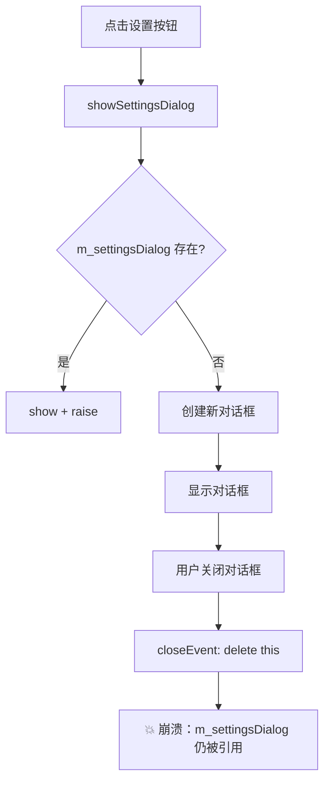
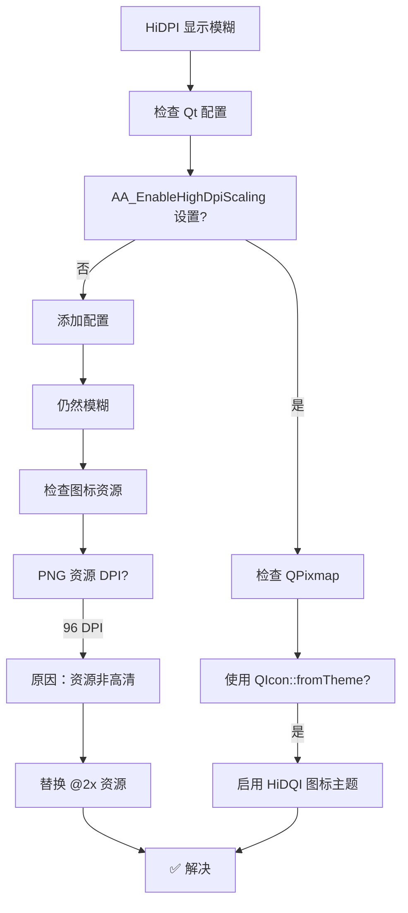
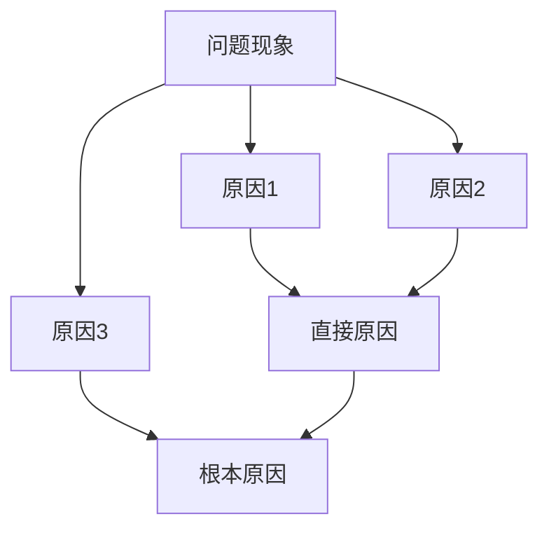
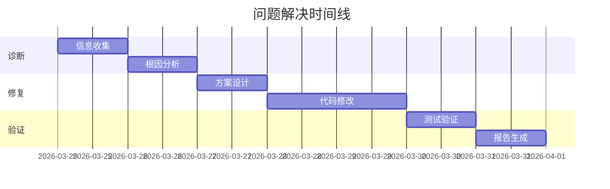

# 问题解决报告模板

## 概述

本文档提供 Qt 问题解决报告的标准模板，包括 Markdown 和 Mermaid 图表。

## 报告结构

```
┌─────────────────────────────────────────┐
│  问题解决报告                            │
├─────────────────────────────────────────┤
│  1. 基本信息                             │
│  2. 问题描述                             │
│  3. 根因分析                             │
│  4. 解决方案                             │
│  5. 验证结果                             │
│  6. 经验教训                             │
│  7. 附件                                 │
└─────────────────────────────────────────┘
```

## 模板 1：简洁报告（适合简单问题）

```markdown
# 问题解决报告：TRB-YYYY-NNN

## 基本信息

| 项目 | 内容 |
|------|------|
| 问题编号 | TRB-2026-001 |
| 发现日期 | 2026-03-26 |
| 问题类型 | 崩溃 |
| 状态 | ✅ 已解决 |

## 问题描述

### 现象
点击设置按钮后应用崩溃退出。

### 环境
- OS: Ubuntu 22.04
- Qt: 6.5.0
- Compiler: GCC 11.4

### 复现步骤
1. 打开应用
2. 点击"设置"按钮
3. 💥 应用崩溃

## 根因分析

### 根本原因
`SettingsDialog` 在 `closeEvent` 中直接 `delete this`，导致按钮点击处理函数中访问已删除的对话框指针。



## 解决方案

### 代码变更

```cpp
// 修改前 (settingswindow.cpp)
void SettingsWindow::closeEvent(QCloseEvent *event) {
    delete m_settingsDialog;  // 💥 直接删除
    QMainWindow::closeEvent(event);
}

// 修改后
void SettingsWindow::closeEvent(QCloseEvent *event) {
    if (m_settingsDialog) {
        m_settingsDialog->deleteLater();  // ✅ 使用 deleteLater
        m_settingsDialog = nullptr;       // ✅ 置空
    }
    QMainWindow::closeEvent(event);
}
```

## 验证结果

- [x] 点击设置按钮，对话框正常显示
- [x] 关闭对话框后，再次点击可正常打开
- [x] 多次打开关闭无崩溃
- [x] 相关功能测试通过

## 经验教训

### 根因
Qt 对象生命周期管理不当，未使用 `deleteLater()` 机制。

### 预防措施
1. 代码审查时重点检查对象生命周期
2. 使用 `QPointer` 保护对话框指针
```

## 模板 2：详细报告（适合复杂问题）

```markdown
# Qt 问题解决报告：TRB-YYYY-NNN

---

## 1. 基本信息

| 项目 | 内容 |
|------|------|
| **问题编号** | TRB-2026-002 |
| **发现日期** | 2026-03-26 |
| **发现人** | xxx |
| **问题类型** | UI 渲染异常 |
| **严重等级** | P2 |
| **影响范围** | 登录界面 |
| **状态** | ✅ 已解决 |
| **解决日期** | 2026-03-26 |

---

## 2. 问题描述

### 2.1 问题现象

登录界面在高分屏（DPI > 150%）下显示模糊，文字和图标边缘有锯齿。

### 2.2 环境信息

| 项目 | 版本 |
|------|------|
| 操作系统 | Windows 11 22H2 |
| Qt 版本 | 6.5.3 |
| 编译器 | MSVC 2022 |
| 构建类型 | Release |
| 显示 DPI | 200% (3840x2160) |

### 2.3 复现步骤

```
1. 启动应用
2. 观察登录界面
3. ❌ 文字和图标模糊
4. 期望：高清显示（HiDPI）
```

### 2.4 期望行为 vs 实际行为

| 项目 | 期望 | 实际 |
|------|------|------|
| 文字清晰度 | 锐利清晰 | 模糊有锯齿 |
| 图标清晰度 | 高清 | 像素化 |
| 整体观感 | 专业精致 | 陈旧感 |

---

## 3. 根因分析

### 3.1 分析过程



### 3.2 可能原因排查

| # | 假设 | 验证方法 | 结果 |
|---|------|----------|------|
| 1 | 未启用 HiDPI 支持 | 检查 `AA_EnableHighDpiScaling` | ❌ 未设置 |
| 2 | 图标资源分辨率低 | 检查 PNG 尺寸 | ❌ 16x16 原始尺寸 |
| 3 | QSS 样式问题 | 检查 background-repeat | ✅ 不是根因 |
| 4 | 字体未高清渲染 | 检查 QFont | ❌ 不是根因 |

### 3.3 根本原因

1. **主因**：未在 `main()` 中启用 Qt HiDPI 缩放
2. **次因**：应用图标仅为 16x16 PNG，未提供 @2x 高清版本

---

## 4. 解决方案

### 4.1 方案描述

1. 在 `main()` 中启用 Qt HiDPI 支持
2. 替换图标资源为 SVG 或提供 @2x 版本

### 4.2 代码变更

```cpp
// main.cpp

// 修改前
int main(int argc, char *argv[]) {
    QApplication app(argc, argv);
    // ...
}

// 修改后
int main(int argc, char *argv[]) {
    // ✅ 启用 HiDPI 缩放
    QApplication::setAttribute(Qt::AA_EnableHighDpiScaling);
    QApplication::setAttribute(Qt::AA_UseHighDpiPixmaps);

    QApplication app(argc, argv);
    // ...
}
```

### 4.3 资源变更

| 文件 | 修改前 | 修改后 |
|------|--------|--------|
| icons/login.png | 16x16 @96dpi | 32x32 @192dpi |
| icons/username.png | 16x16 @96dpi | 32x32 @192dpi |
| icons/password.png | 16x16 @96dpi | 32x32 @192dpi |

### 4.4 替代方案（推荐用于新项目）

使用 SVG 图标，通过 `QSvgRenderer` 渲染：

```cpp
// SvgIconProvider.h
class SvgIconProvider : public QFileIconProvider {
public:
    QIcon icon(const QFileInfo &info) const override {
        if (info.suffix().toLower() == "svg") {
            QSvgRenderer renderer(info.filePath());
            QPixmap pixmap(renderer.defaultSize());
            pixmap.fill(Qt::Transparent);
            QPainter painter(&pixmap);
            renderer.render(&painter);
            return QIcon(pixmap);
        }
        return QFileIconProvider::icon(info);
    }
};
```

---

## 5. 验证结果

### 5.1 功能测试

| 用例 | 预期结果 | 实际结果 | 状态 |
|------|----------|----------|------|
| 启动应用 | 正常显示登录界面 | 正常显示 | ✅ |
| 文字显示 | 清晰无锯齿 | 清晰无锯齿 | ✅ |
| 图标显示 | 高清锐利 | 高清锐利 | ✅ |
| 其他界面 | 无退化 | 无退化 | ✅ |

### 5.2 多环境测试

| 环境 | DPI | 测试结果 |
|------|-----|----------|
| Windows 11 | 100% (1920x1080) | ✅ 正常 |
| Windows 11 | 150% (2560x1440) | ✅ 正常 |
| Windows 11 | 200% (3840x2160) | ✅ 正常 |
| Ubuntu 22.04 | 100% | ✅ 正常 |
| macOS Monterey | Retina | ✅ 正常 |

### 5.3 回归测试

- [x] 登录功能测试
- [x] 主界面导航测试
- [x] 设置功能测试
- [x] 应用关闭测试

---

## 6. 经验教训

### 6.1 根因总结

未启用 Qt HiDPI 支持导致应用在高分屏上显示模糊。

### 6.2 预防措施

| 措施 | 描述 | 负责人 |
|------|------|--------|
| 开发规范更新 | 新项目必须启用 HiDPI | xxx |
| 代码审查清单 | 添加 HiDPI 检查项 | xxx |
| 图标规范 | 要求提供 SVG 或 @2x 资源 | xxx |

### 6.3 相关文档更新

- [x] 开发规范文档 - 添加 HiDPI 支持要求
- [x] 图标制作规范 - 添加高清图标要求
- [ ] UI 设计检查清单 - 待更新

---

## 7. 附件

| 文件名 | 描述 |
|--------|------|
| `attachment/before.png` | 修复前截图 |
| `attachment/after.png` | 修复后截图 |
| `attachment/stacktrace.txt` | 相关日志（如有） |
| `attachment/main.cpp.diff` | 代码变更 diff |

---

## Mermaid 图表参考

### 问题流程图


### 根因分析图



### 时间线图


