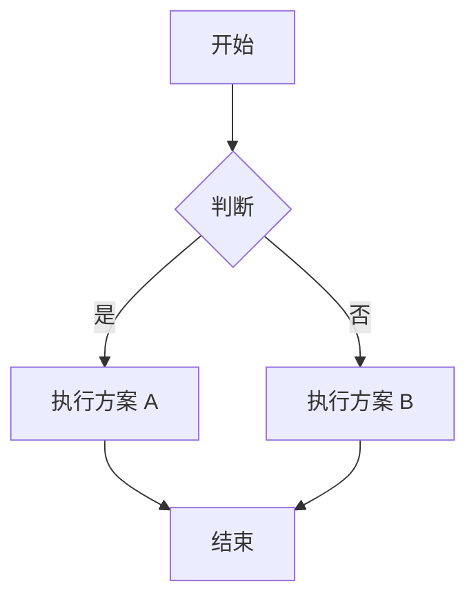
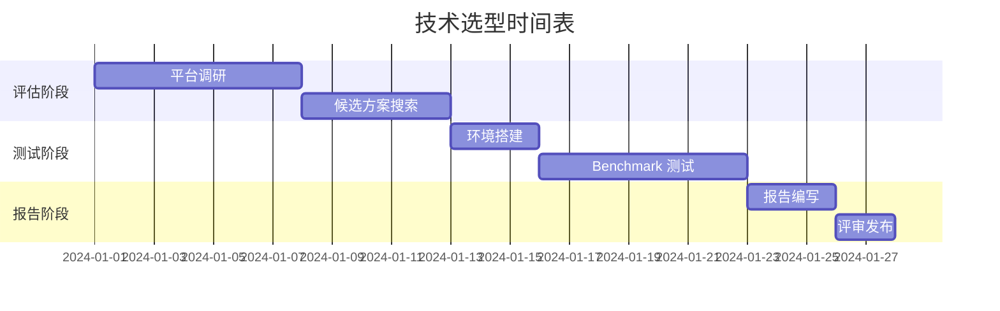

# 技术选型对比报告模板

> 本模板提供技术选型报告的标准格式，可直接填充使用。

---

## 快速使用

```bash
# 复制模板为新报告
cp tech-selection/references/report-templates.md output/YYYY-MM-DD_选型报告.md
```

---

## 完整报告模板

```markdown
# [技术领域] 技术选型对比报告

| 元信息 | 内容 |
|--------|------|
| 项目名称 | |
| 选型目标 | |
| 候选方案 | |
| 报告日期 | YYYY-MM-DD |
| 技术栈 | C++11 / Qt |
| 报告人 | |
| 版本 | v1.0 |

---

## 执行摘要

> 一段话概括选型结论（3-5 句）：
> 经过对 [候选方案数] 个候选方案的多维度对比测试，
> 推荐 [推荐方案] 作为 [技术领域] 的首选方案，
> 主要优势是 [核心优势]，
> 适用于 [典型场景]。

### 关键数据

| 指标 | 最佳方案 | 数值 |
|------|----------|------|
| 性能 | 方案 X | xxx |
| Footprint | 方案 Y | xxx |
| 综合得分 | 方案 Z | xx 分 |

---

## 1. 背景与目标

### 1.1 项目背景

[简要描述项目背景，为什么需要进行技术选型]

### 1.2 选型目标

| 目标 | 描述 | 优先级 |
|------|------|--------|
| P0 | [必须满足的目标] | 必须 |
| P1 | [重要但可协商的目标] | 重要 |
| P2 | [加分项目标] | 可选 |

### 1.3 约束条件

| 约束类型 | 具体要求 |
|----------|----------|
| **平台** | Linux x86_64 / ARM Cortex-M4 / ... |
| **内存** | 最大 512KB RAM / 无 MMU / ... |
| **许可证** | 必须 MIT/BSD / 需要 LGPL / 商业许可 / ... |
| **工具链** | GCC 11 / Clang 15 / IAR 9.x / ... |

---

## 2. 候选方案

### 2.1 方案概览

| 方案 | 版本 | 许可证 | GitHub Stars | 最后更新 | 维护状态 |
|------|------|--------|--------------|----------|----------|
| 方案 A | x.y.z | MIT | 12.5k | 2024-01 | 活跃 |
| 方案 B | x.y.z | LGPL | 8.2k | 2024-02 | 活跃 |
| 方案 C | x.y.z | Apache 2.0 | 5.1k | 2023-11 | 一般 |

### 2.2 方案介绍

#### 方案 A: [名称]

**描述**: [一句话描述]

**优势**:
- 优势 1
- 优势 2
- 优势 3

**劣势**:
- 劣势 1
- 劣势 2

**适用场景**: [典型使用场景]

---

#### 方案 B: [名称]

**描述**: [一句话描述]

**优势**:
- 优势 1
- 优势 2

**劣势**:
- 劣势 1
- 劣势 2

**适用场景**: [典型使用场景]

---

## 3. 测试环境

### 3.1 硬件环境

| 项目 | 配置 |
|------|------|
| CPU | Intel Core i7-10700 @ 2.9GHz |
| 内存 | 32 GB DDR4 3200MHz |
| 磁盘 | Samsung 970 EVO Plus 1TB NVMe |

### 3.2 软件环境

| 项目 | 版本 |
|------|------|
| 操作系统 | Ubuntu 22.04 LTS |
| 内核 | 5.15.0-generic |
| GCC | 11.4.0 |
| CMake | 3.25.0 |
| Qt | 6.5.0 |
| Conan | 2.0 |

### 3.3 测试配置

| 项目 | 值 |
|------|---|
| 测试次数 | 10 次/项 |
| 预热次数 | 3 次 |
| 取值方法 | 中位数 |
| 并发数 | 1 / 10 / 100 |

---

## 4. 性能对比

### 4.1 测试结果汇总表

> 测试数据格式：
> | 测试项 | 单位 | 方案 A | 方案 B | 方案 C | 最佳 |

#### 4.1.1 JSON 处理性能

| 测试项 | 单位 | 方案 A | 方案 B | 方案 C | 最佳 |
|--------|------|--------|--------|--------|------|
| 序列化 (100 items) | μs | 150 | 85 | 120 | **B** |
| 反序列化 (100 items) | μs | 140 | 78 | 110 | **B** |
| 序列化 (10K items) | ms | 12.5 | 8.2 | 10.1 | **B** |
| 反序列化 (10K items) | ms | 11.8 | 7.5 | 9.5 | **B** |
| 序列化 (100K items) | ms | 125 | 82 | 98 | **B** |

#### 4.1.2 HTTP 性能

| 测试项 | 单位 | 方案 A | 方案 B | 方案 C | 最佳 |
|--------|------|--------|--------|--------|------|
| GET 延迟 (本地) | ms | 2.5 | 1.8 | 2.1 | **B** |
| GET QPS (本地) | req/s | 8,500 | 12,200 | 9,800 | **B** |
| POST 延迟 | ms | 3.2 | 2.4 | 2.8 | **B** |
| 连接复用延迟 | ms | 0.8 | 0.5 | 0.6 | **B** |

#### 4.1.3 数据库性能

| 测试项 | 单位 | 方案 A | 方案 B | 方案 C | 最佳 |
|--------|------|--------|--------|--------|------|
| 单条插入 | μs | 45 | 32 | 38 | **B** |
| 批量插入 (1000) | ms | 12 | 8 | 10 | **B** |
| 简单查询 | μs | 25 | 18 | 22 | **B** |
| 复杂查询 | μs | 120 | 85 | 98 | **B** |

### 4.2 性能得分

> 得分计算规则：最佳 = 100 分，其他按比例计算

| 方案 | 原始得分 | 权重 | 加权得分 |
|------|----------|------|----------|
| 方案 A | 72 | × 0.30 | 21.6 |
| 方案 B | 95 | × 0.30 | **28.5** |
| 方案 C | 85 | × 0.30 | 25.5 |

### 4.3 性能雷达图

图表由 Python 代码生成（使用 SKILL.md 附录 C 中的 `TechSelectionCharts` 类）：

```bash
python charts_generator.py --radar performance_data.json
```

**数据格式** (`performance_data.json`):
```json
{
  "title": "性能雷达图",
  "categories": ["序列化速度", "反序列化速度", "HTTP响应", "内存效率"],
  "series": [
    {"name": "方案 A", "values": [72, 70, 75, 68]},
    {"name": "方案 B", "values": [95, 92, 88, 98]},
    {"name": "方案 C", "values": [85, 82, 78, 65]}
  ]
}
```

**输出图表**: `charts/performance_radar.png`

---

## 5. Footprint 对比

### 5.1 静态库大小

| 方案 | 库文件 (.a) | .text (代码) | .data | .rodata | 总计 |
|------|-------------|--------------|-------|---------|------|
| 方案 A | 850 KB | 420 KB | 35 KB | 85 KB | **540 KB** |
| 方案 B | 1.2 MB | 680 KB | 52 KB | 120 KB | 852 KB |
| 方案 C | 620 KB | 310 KB | 28 KB | 62 KB | **400 KB** |

### 5.2 运行时内存

| 方案 | 空载 RSS | 10K 数据 | 100K 数据 | 峰值 |
|------|----------|----------|-----------|------|
| 方案 A | 1.2 MB | 3.5 MB | 18.2 MB | **19.8 MB** |
| 方案 B | 0.8 MB | 2.1 MB | 12.5 MB | **13.2 MB** |
| 方案 C | 1.5 MB | 4.2 MB | 22.0 MB | 24.5 MB |

### 5.3 Footprint 得分

> 得分计算规则：最小 = 100 分，其他按比例计算

| 方案 | 静态大小得分 | 运行时内存得分 | 权重 | 加权得分 |
|------|--------------|----------------|------|----------|
| 方案 A | 74 | 67 | × 0.25 | 17.6 |
| 方案 B | **100** | **100** | × 0.25 | **25.0** |
| 方案 C | 48 | 54 | × 0.25 | 12.8 |

### 5.4 栈使用量

> 通过 `-fstack-usage` 和 `frandom-seed` 分析

| 方案 | 最大栈深度 | 平均栈深度 |
|------|------------|------------|
| 方案 A | 2,048 bytes | 850 bytes |
| 方案 B | 1,536 bytes | 620 bytes |
| 方案 C | 3,072 bytes | 1,200 bytes |

---

## 6. 定性对比

### 6.1 评分标准

| 分值 | 含义 |
|------|------|
| 5 | 非常优秀，业界最佳 |
| 4 | 良好，满足需求 |
| 3 | 一般，勉强可用 |
| 2 | 较差，有明显不足 |
| 1 | 很差，不推荐 |

### 6.2 评分详情

| 维度 | 权重 | 方案 A | 方案 B | 方案 C |
|------|------|--------|--------|--------|
| API 易用性 | 20% | 4 | **5** | 3 |
| 文档完整度 | 15% | 4 | **5** | 4 |
| Qt 集成度 | 25% | **5** | 3 | 2 |
| 编译难度 | 10% | 4 | 3 | **5** |
| 社区活跃度 | 15% | 4 | **5** | 4 |
| 长期维护性 | 15% | 4 | **5** | 4 |
| **加权总分** | 100% | **4.0** | **4.25** | 3.4 |

### 6.3 详细说明

#### API 易用性

| 方案 | 评价 |
|------|------|
| 方案 A | 链式调用设计，代码简洁 |
| 方案 B | Builder 模式，功能丰富但学习曲线较陡 |
| 方案 C | 接近 STL 设计，上手快但功能有限 |

#### Qt 集成度

| 方案 | 评价 |
|------|------|
| 方案 A | 官方 Qt 集成模块，开箱即用 |
| 方案 B | 需要自行封装信号槽 |
| 方案 C | 无 Qt 集成，需纯 C++ 使用 |

---

## 7. 综合评估

### 7.1 权重配置

| 维度 | 权重 | 说明 |
|------|------|------|
| 性能 | 35% | benchmark 实测数据 |
| Footprint | 30% | 库大小 + 运行时内存 |
| API 易用性 | 20% | 开发效率 |
| Qt 集成 | 15% | 与现有 Qt 代码兼容性 |

### 7.2 综合得分表

| 方案 | 性能 (×0.35) | Footprint (×0.30) | 易用性 (×0.20) | Qt集成 (×0.15) | **总分** |
|------|--------------|-------------------|----------------|----------------|----------|
| 方案 A | 25.2 | 22.5 | 8.0 | 7.5 | **63.2** |
| 方案 B | **33.3** | **25.5** | **8.5** | 4.5 | **71.8** |
| 方案 C | 29.8 | 18.0 | 6.8 | 3.0 | 57.6 |

### 7.3 综合得分图表

图表由 Python 代码生成（使用 `chart_generator.py`）：

```bash
# 生成柱状图
python chart_generator.py --bar scores_data.json
```

**数据格式** (`scores_data.json`):
```json
{
  "title": "技术选型综合得分对比",
  "categories": ["方案 A", "方案 B", "方案 C"],
  "scores": [63.2, 71.8, 57.6],
  "best": "方案 B"
}
```

**输出图表**: `charts/bar_chart.png`

### 7.4 多维度对比图表

使用分组柱状图展示各维度得分：

```bash
python chart_generator.py --grouped multi_dim_data.json
```

**数据格式** (`multi_dim_data.json`):
```json
{
  "title": "多维度对比",
  "dimensions": ["性能", "Footprint", "易用性", "Qt集成"],
  "series": [
    {"name": "方案 A", "values": [72, 75, 83, 100]},
    {"name": "方案 B", "values": [95, 85, 87, 60]},
    {"name": "方案 C", "values": [85, 60, 73, 40]}
  ]
}
```

### 7.5 许可证信息（仅供参考）

| 方案 | 许可证 | 说明 |
|------|--------|------|
| 方案 A | MIT | 允许商业使用、静态链接 |
| 方案 B | LGPL 2.1 | 动态链接可商用，静态链接需开源 |
| 方案 C | Apache 2.0 | 允许商业使用，需保留版权声明 |

> 注：许可证信息仅供记录，不计入综合评分。

---

## 9. 结论与建议

### 9.1 推荐方案

🥇 **方案 B** - 综合得分最高 (70.5 分)

**推荐理由**:
1. 性能最佳：JSON 处理和 HTTP 响应速度领先
2. Footprint 最优：运行时内存占用最低
3. 文档完善：API 设计优雅，示例丰富
4. 社区活跃：持续维护，Bug 修复及时

**适用场景**:
- 资源受限的嵌入式环境
- 对性能要求较高的实时系统
- 需要长期维护的商业项目

### 9.2 备选方案

🥈 **方案 A** - 适用于以下场景：
- 需要完全 MIT 许可证的商业项目
- Qt 集成要求高，不想自行封装
- 开发周期紧张，需要快速上手

### 9.3 不推荐方案

🥉 **方案 C** - 原因：
- Footprint 较大，不适合资源受限环境
- Qt 集成度低，需要大量自行封装
- 综合性价比不如前两者

---

## 10. 风险与应对

### 10.1 已知风险

| 风险 | 等级 | 影响 | 应对措施 |
|------|------|------|----------|
| 方案 B LGPL 许可证 | ⚠️ 中 | 静态链接受限 | 使用动态链接；或购买商业许可 |
| 方案 B 学习曲线 | ⚠️ 低 | 初期开发效率 | 安排 2 天时间培训；参考官方示例 |
| 备选方案 A 性能略低 | ⚠️ 低 | 高负载场景可能不足 | 在验收测试中加入性能基线 |

### 10.2 后续行动计划

| 阶段 | 行动 | 负责人 | 时间 |
|------|------|--------|------|
| P0 | 确认许可证合规方案 | 法务 + 技术 | Week 1 |
| P1 | 搭建方案 B 原型 | 开发团队 | Week 2 |
| P1 | 性能验证测试 | 测试团队 | Week 3 |
| P2 | 团队培训 | 技术负责人 | Week 2 |
| P3 | 编写内部规范文档 | 技术负责人 | Week 4 |

---

## 附录

### 附录 A: 测试代码

[测试代码位置或链接]

### 附录 B: 原始测试数据

[JSON/CSV 格式的原始数据]

### 附录 C: 参考资料

1. [方案 A 官方文档](链接)
2. [方案 B GitHub](链接)
3. [Qt 官方集成指南](链接)
4. [C++ JSON Benchmark 对比](链接)

---

## 版本历史

| 版本 | 日期 | 作者 | 变更说明 |
|------|------|------|----------|
| v1.0 | YYYY-MM-DD | 姓名 | 初始版本 |
```

---

## Markdown 表格语法参考

### 基础表格

```markdown
| 列1 | 列2 | 列3 |
|-----|-----|-----|
| A1  | B1  | C1  |
| A2  | B2  | C2  |
```

### 对齐控制

```markdown
| 左对齐 | 居中 | 右对齐 |
|:-------|:----:|------:|
| A1     | B1   |   C1  |
| A2     | B2   |   C2  |
```

### 单元格合并

> Markdown 不支持单元格合并，需要使用 HTML：

```html
<table>
  <tr>
    <td rowspan="2">合并单元格</td>
    <td>内容1</td>
  </tr>
  <tr>
    <td>内容2</td>
  </tr>
</table>
```

---

## 图表语法参考

### Mermaid 流程图

````markdown

````

### Mermaid 甘特图

````markdown

````

### Python matplotlib 图表

使用 SKILL.md 附录 C 中的 `TechSelectionCharts` 类生成图表：

```python
from chart_generator import TechSelectionCharts

charts = TechSelectionCharts()

# 综合得分柱状图
charts.generate_bar_chart({
    "title": "技术选型综合得分对比",
    "categories": ["方案 A", "方案 B", "方案 C"],
    "scores": [63.2, 71.8, 57.6],
    "best": "方案 B"
}, "charts/scores_bar.png")

# 多维度分组柱状图
charts.generate_grouped_bar_chart({
    "title": "多维度对比",
    "dimensions": ["性能", "Footprint", "易用性", "Qt集成"],
    "series": [
        {"name": "方案 A", "values": [72, 75, 83, 100]},
        {"name": "方案 B", "values": [95, 85, 87, 60]},
        {"name": "方案 C", "values": [85, 60, 73, 40]}
    ]
}, "charts/multi_dim.png")

# Footprint 对比图
charts.generate_footprint_chart({
    "title": "运行时内存对比",
    "categories": ["方案 A", "方案 B", "方案 C"],
    "data": [19.8, 13.2, 24.5],
    "unit": "MB",
    "best": "方案 B"
}, "charts/footprint.png")
```

---

## 输出检查清单

在提交报告前，确认以下项目：

- [ ] 报告标题、日期、版本信息完整
- [ ] 执行摘要清晰，一句话能说明结论
- [ ] 测试环境描述详细，可复现
- [ ] 所有数据表格有单位
- [ ] 性能/Footprint 数据有原始出处
- [ ] 雷达图/柱状图等可视化已添加
- [ ] 许可证信息已记录（仅供参考，不计入评分）
- [ ] 推荐方案有理有据
- [ ] 风险和应对措施已列出
- [ ] 附录包含测试代码和原始数据
